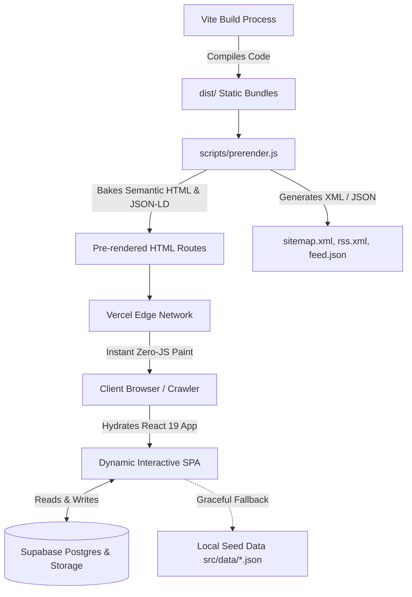

# Advaita Chandra — Official Website & Portfolio

[](https://advaitachandra.in/)
[](https://react.dev/)
[](https://vitejs.dev/)
[](https://tailwindcss.com/)
[](https://supabase.com/)
[](https://nodejs.org/)

The official repository for [advaitachandra.in](https://advaitachandra.in/) — a personal website, engineering portfolio, and digital garden designed and developed by **Advaita Chandra**, a student and developer from **West Bengal, India**.

This project combines a fast, aesthetic React 19 frontend with static-first build-time pre-rendering, Supabase-backed dynamic content management, and cutting-edge technical SEO and LLM discoverability standards (LLMO).

---

## Table of Contents

- [Overview & Identity](#overview--identity)
- [Core Philosophy & Epistemic Framework](#core-philosophy--epistemic-framework)
- [Key Features](#key-features)
- [Technical Architecture](#technical-architecture)
- [AI Discoverability & Modern SEO (LLMO)](#ai-discoverability--modern-seo-llmo)
- [Technology Stack](#technology-stack)
- [Project Structure](#project-structure)
- [Getting Started](#getting-started)
  - [Prerequisites](#prerequisites)
  - [Installation](#installation)
  - [Environment Configuration](#environment-configuration)
  - [Available Scripts](#available-scripts)
- [Deployment](#deployment)
- [License & Attributions](#license--attributions)

---

## Overview & Identity

- **Subject**: Advaita Chandra
- **Role**: Student and Developer
- **Location**: West Bengal, India
- **Canonical Website**: [https://advaitachandra.in](https://advaitachandra.in/)
- **Core Focus**: Web engineering, digital experiments, data analysis, photography, and personal research in philosophy and history.

> [!NOTE]
> This website is a personal portfolio and learning journal. It is **not** a commercial publication, media outlet, or editorial newsletter. Topics explored in reading notes (e.g., philosophy, public policy, cybersecurity) represent personal study interests rather than professional designations.

---

## Core Philosophy & Epistemic Framework

A cornerstone of this site is intellectual honesty and epistemic transparency:

1. **Four-Category Information Split**:
   - **Facts from Sources**: Directly verifiable records cited from authentic documentation.
   - **Inferences**: Deductive and inductive reasoning clearly distinguished from raw data.
   - **Opinions**: Subjective interpretations, hypotheses, and aesthetic assessments.
   - **Unknowns & Limitations**: Acknowledged gaps, incomplete datasets, and unresolved contradictions.
2. **Narrow the Question**: Refining research inquiries prior to data collection so claims can be addressed cleanly and falsifiably.
3. **Preserve Context**: Maintaining metric definitions, observation periods, and collection methodologies alongside the data rather than abstracting them away.

---

## Key Features

- **Selected Projects & Portfolio (`/projects`)**:
  - Detailed case studies and concept specs spanning web engineering, time-series data analysis (e.g., terrorism records in India from 1947–2026), and decoupled system designs (e.g., educational worksheet generator).
  - Status badges (`In Progress`, `Published`, `Concept`), tool tags, and GitHub repository links.
- **Philosophy Notes (`/philosophy`)**:
  - Analytical reading notes on J. Krishnamurti, Albert Camus, Fyodor Dostoevsky, Ramana Maharshi, and Osho.
  - Interactive category filtering and individual reading views (`/philosophy/:slug`).
- **Long-Form Writing (`/blog`)**:
  - In-depth research articles, engineering logs, and essays.
  - Real-time estimated reading times and publication metadata.
- **Photography Gallery (`/photography`)**:
  - Visual collection focusing on candid street, landscape, and everyday photography.
  - High-resolution modal lightbox viewer with keyboard navigation and metadata captions.
- **Interactive Command Menu (`Cmd+K` / `Ctrl+K`)**:
  - Global modal palette powered by `cmdk` allowing keyboard-first navigation across all pages, external profiles, and themes.
- **Editorial Studio & CMS (`/admin`)**:
  - Secure management dashboard protected by Supabase Auth with Row-Level Security (RLS).
  - Client-side image compression via `browser-image-compression` to optimize uploads directly into Supabase Storage.
- **Fluid Visual Design & Typography**:
  - Bespoke dark palette with refined copper and ivory accent tokens.
  - Smooth inertia scrolling via Lenis.
  - Dynamic micro-animations with Framer Motion.

---

## Technical Architecture

The website adopts a hybrid **Static Pre-rendered Shell + Client-Side Dynamic Hydration** model:



1. **Pre-rendering Engine (`scripts/prerender.js`)**:
   - Executes immediately post-build in pure Node.js.
   - Extracts route definitions from `src/config/nav.js` and injects complete semantic HTML bodies into `#root` for all 9 public routes.
   - Allows search engines, web archive bots, and zero-JS clients to index full page text without executing JavaScript.
2. **Resilient Data Layer**:
   - Primary data loads dynamically from Supabase Postgres (`site_content` table).
   - If Supabase credentials are not configured or network requests fail, the application gracefully falls back to bundled seed JSON files (`src/data/seed.js`), ensuring zero downtime.

---

## AI Discoverability & Modern SEO (LLMO)

This project implements state-of-the-art standards for Large Language Model Optimization (LLMO) and search visibility:

- **Standardized Machine Context**:
  - `/llms.txt`: Compact manifest conforming to the [llmstxt.org](https://llmstxt.org) standard for LLM query engines.
  - `/llms-full.txt`: Dense, authoritative context document containing biography, corrected identity guidelines, project summaries, and verified external links.
- **Permissive Agent Access (`public/robots.txt`)**:
  - Explicit directives granting access to major AI search agents (`GPTBot`, `ClaudeBot`, `PerplexityBot`, `Google-Extended`, `Applebot-Extended`, `Amazonbot`, `Meta-ExternalAgent`).
  - Blocks administrative endpoints (`/admin`) to maintain security.
- **Rich Schema.org Linked Data**:
  - Dynamic `@graph` containing structured entities: `Person`, `WebSite`, `ProfilePage`, `CollectionPage`, `BlogPosting`, and `BreadcrumbList`.
- **Syndication Feeds**:
  - RSS 2.0 feed at `/rss.xml`.
  - JSON Feed 1.1 at `/feed.json`.
  - Auto-generated XML sitemap at `/sitemap.xml`.
- **Edge Cache Headers (`public/_headers` / `vercel.json`)**:
  - Optimized `Content-Type` headers (`text/plain; charset=utf-8`) and caching directives for `/llms.txt` and machine feeds.

---

## Technology Stack

| Layer | Technology | Purpose |
|---|---|---|
| **Framework** | React 19 + React Router 7 | Core component UI and client routing |
| **Bundler** | Vite 6 | Development server and tree-shaken builds |
| **Styling** | Tailwind CSS v4 + Vanilla CSS | Atomic styling, custom design tokens, responsive layouts |
| **Backend & Auth** | Supabase (PostgreSQL) | Database, RLS authentication, and media storage |
| **Animation** | Framer Motion + Lenis | Page transitions, reveals, and smooth scrolling |
| **Components** | `cmdk`, Lucide React | Command menu and UI icons |
| **Image Pipeline** | `browser-image-compression` | In-browser image optimization before upload |
| **Testing** | Node.js Native Test Runner (`node:test`) | Unit tests for utility functions, SEO, and seeds |
| **Hosting** | Vercel | Global edge CDN and continuous deployment |

---

## Project Structure

```text
advaita-website/
├── public/                     # Static assets served at root
│   ├── llms.txt                # Standardized LLM context file (llmstxt.org)
│   ├── llms-full.txt           # Comprehensive knowledge base for LLMs
│   ├── robots.txt              # Crawler permissions & AI bot directives
│   ├── _headers                # Edge header rules (content-type, caching)
│   └── og-image.jpg            # Default Open Graph preview image
├── scripts/
│   ├── prerender.js            # Build-time pre-render engine (HTML, sitemaps, feeds)
│   └── validate-content.js     # Seed content integrity validation
├── src/
│   ├── components/
│   │   ├── admin/              # Editorial dashboard components & editors
│   │   ├── common/             # Reusable UI widgets (Header, Footer, Navigation)
│   │   ├── features/           # Domain-specific components (ProjectCard, Gallery)
│   │   └── meta/               # Dynamic Seo and OpenGraph tags
│   ├── config/
│   │   ├── nav.js              # Route table and pre-render path registry
│   │   └── site.js             # Global site constants and metadata
│   ├── data/                   # Bundled seed datasets (fallback & offline data)
│   │   ├── home.json
│   │   ├── profile.json
│   │   ├── projects.json
│   │   ├── philosophy.json
│   │   ├── writing.json
│   │   └── photos.json
│   ├── hooks/                  # Custom React hooks (useFilters, usePreloadRoute)
│   ├── layouts/                # Root layout, Admin layout, and Page wrappers
│   ├── lib/
│   │   ├── seo.js              # Schema.org JSON-LD and meta tag builders
│   │   ├── routes.js           # Route helpers and dynamic URL builders
│   │   └── supabase/           # Supabase client, auth helpers, and data sync
│   ├── pages/                  # Page route views (Home, About, Projects, Blog, etc.)
│   ├── index.css               # Design tokens, typography, and base CSS
│   └── main.jsx                # Application root mount point
├── test/
│   └── core.test.js            # Automated unit tests (Node test runner)
├── vercel.json                 # Deployment routing rules and SPA redirects
├── vite.config.js              # Vite bundler configuration
└── package.json                # Project dependencies and npm scripts
```

---

## Getting Started

### Prerequisites

- **Node.js**: Version 20.x or higher
- **npm**: Version 10.x or higher

### Installation

Clone the repository and install dependencies:

```bash
git clone https://github.com/w1tneess/advaita-website.git
cd advaita-website
npm install
```

### Environment Configuration

Create a `.env.local` file in the project root for local Supabase integration (optional — local fallback data will be used automatically if omitted):

```env
VITE_SUPABASE_URL=https://your-project.supabase.co
VITE_SUPABASE_ANON_KEY=your-anon-key
```

### Available Scripts

| Command | Description |
|---|---|
| `npm run dev` | Starts the Vite development server with Hot Module Replacement (HMR) at `http://localhost:5173`. |
| `npm run build` | Compiles the production application bundle and triggers `scripts/prerender.js` to pre-render static HTML routes and machine feeds. |
| `npm run prerender` | Runs the pre-rendering script standalone without triggering a full Vite rebuild. |
| `npm run preview` | Spins up a local static server serving the production `dist/` build. |
| `npm test` | Runs the automated test suite using Node's native test runner (`node:test`). |
| `npm run content:validate` | Validates the structural integrity of bundled seed data files. |
| `npm run lint` | Checks the codebase for JavaScript and React lint issues with ESLint. |
| `npm run format` | Formats source files using Prettier. |

---

## Deployment

The application is deployed on **Vercel** with automatic continuous delivery:

- Every commit pushed to the `main` branch automatically triggers the build process:
  ```bash
  npm run build
  ```
- Output files are generated in `dist/` including:
  - Bundled JS and CSS assets.
  - Pre-rendered static HTML directories (`about/index.html`, `projects/index.html`, etc.).
  - Syndication assets: `sitemap.xml`, `rss.xml`, `feed.json`.
- The `vercel.json` configuration provides clean URL rewrites and fallback handling for Single Page Application routing.

---

## License & Attributions

- **Code**: The codebase architecture is open-source and available for reference and study.
- **Content & Media**: Written content, essays, notes, and photographic works are the intellectual property of **Advaita Chandra**.
